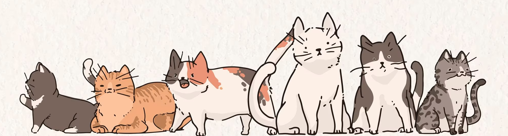

<!-- Headings -->
# Hi! I'm Danna :mushroom:

**About me**
<!-- paragraph -->
I am a recent sophomore transfer student taking my first steps into IT and CS. I don't have any prior coding experience (_complete newbie_) and excited to learn! My other interests include fashion design, sewing, drawing and anything creative. 
I am currently learning: 
* Python
* HTML
* Javascript 
* CSS 

The other reasources I've been using to learn coding are [code academy](https://www.codecademy.com/learn) and [udemy](https://www.udemy.com/) courses.

**Navigate more about me using these links**
<!-- OL -->
1. [Meet My cats](./Meet_My_Cats.md)
2. [Skills](./skills.md)
3. [Hobbies](./hobbies.md)
4. [Code Sample](./code_sample.md)

